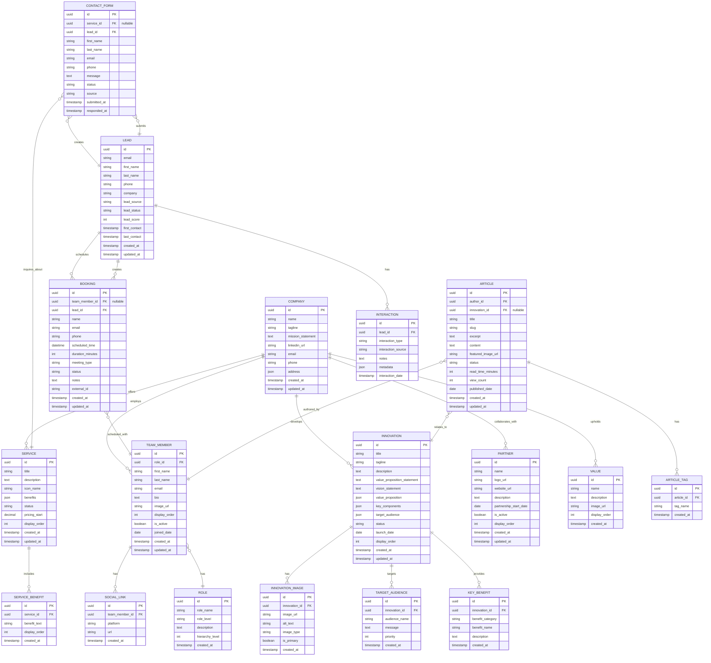

# GRANVILLE-TECH DATA MODEL & ENTITY RELATIONSHIP DIAGRAM

> **Purpose**: This document defines the data architecture, entity relationships, service models, and UI data structures for the Granville-Tech website and future backend implementation.

---

## TABLE OF CONTENTS
1. [Current State (Frontend-Only)](#1-current-state-frontend-only)
2. [Entity Relationship Diagram](#2-entity-relationship-diagram)
3. [Database Schema Design](#3-database-schema-design)
4. [Service Models](#4-service-models)
5. [UI Data Structures](#5-ui-data-structures)
6. [API Contract Specifications](#6-api-contract-specifications)
7. [Data Flow Architecture](#7-data-flow-architecture)
8. [Migration Strategy](#8-migration-strategy)

---

## 1. CURRENT STATE (Frontend-Only)

### 1.1 Data Storage Overview
The website currently operates with:
- **Static Data**: Hardcoded in component files
- **No Database**: All content is client-side
- **Third-Party Services**: 
  - EmailJS for contact forms
  - Calendly for booking

### 1.2 Data Location Map
```
┌─────────────────────────────────────────────────────────┐
│ CURRENT DATA SOURCES                                    │
├─────────────────────────────────────────────────────────┤
│ Innovations    → src/pages/innovations.jsx (Array)     │
│ Team Members   → src/pages/team.jsx (Array)            │
│ Services       → src/pages/services.jsx (Array)        │
│ Partners       → src/pages/partners.jsx (Array)        │
│ Contact Forms  → EmailJS External API                  │
│ Bookings       → Calendly External API                 │
│ Assets         → src/assets/ (Static Files)            │
└─────────────────────────────────────────────────────────┘
```

---

## 2. ENTITY RELATIONSHIP DIAGRAM

### 2.1 Conceptual ERD (Mermaid Diagram)



### 2.2 Entity Relationships Summary

| Entity | Relationship | Related Entity | Cardinality |
|--------|--------------|----------------|-------------|
| Company | develops | Innovation | One-to-Many |
| Company | offers | Service | One-to-Many |
| Company | employs | Team Member | One-to-Many |
| Company | collaborates with | Partner | One-to-Many |
| Innovation | has | Images | One-to-Many |
| Innovation | targets | Target Audience | One-to-Many |
| Innovation | provides | Key Benefits | One-to-Many |
| Team Member | has | Role | Many-to-One |
| Team Member | has | Social Links | One-to-Many |
| Service | includes | Service Benefits | One-to-Many |
| Contact Form | inquires about | Service | Many-to-One |
| Contact Form | creates | Lead | Many-to-One |
| Booking | scheduled with | Team Member | Many-to-One |
| Article | authored by | Team Member | Many-to-One |
| Article | relates to | Innovation | Many-to-One |
| Lead | submits | Contact Forms | One-to-Many |
| Lead | schedules | Bookings | One-to-Many |
| Lead | has | Interactions | One-to-Many |

---

## 3. DATABASE SCHEMA DESIGN

### 3.1 Technology Recommendations
- **Database**: PostgreSQL 15+ (JSONB support, UUID, full-text search)
- **ORM**: Prisma or TypeORM (type-safe, migrations)
- **Hosting**: AWS RDS, Supabase, or Railway
- **Caching**: Redis for frequently accessed data

### 3.2 Core Tables

#### 3.2.1 Company Table
```sql
CREATE TABLE companies (
    id UUID PRIMARY KEY DEFAULT gen_random_uuid(),
    name VARCHAR(255) NOT NULL,
    tagline VARCHAR(500),
    mission_statement TEXT,
    linkedin_url VARCHAR(500),
    email VARCHAR(255),
    phone VARCHAR(50),
    address JSONB,
    metadata JSONB,
    created_at TIMESTAMP DEFAULT CURRENT_TIMESTAMP,
    updated_at TIMESTAMP DEFAULT CURRENT_TIMESTAMP
);

-- Single company instance for Granville-Tech
INSERT INTO companies (name, tagline, email) VALUES 
('Granville-Tech', 'Driving Innovation with AI Solutions', 'contact@granville-tech.com');
```

#### 3.2.2 Innovations Table
```sql
CREATE TABLE innovations (
    id UUID PRIMARY KEY DEFAULT gen_random_uuid(),
    title VARCHAR(255) NOT NULL,
    slug VARCHAR(255) UNIQUE NOT NULL,
    tagline VARCHAR(500),
    description TEXT,
    value_proposition_statement TEXT,
    vision_statement TEXT,
    value_proposition JSONB,
    key_components JSONB,
    target_audience JSONB,
    status VARCHAR(50) DEFAULT 'active',
    launch_date DATE,
    display_order INT DEFAULT 0,
    created_at TIMESTAMP DEFAULT CURRENT_TIMESTAMP,
    updated_at TIMESTAMP DEFAULT CURRENT_TIMESTAMP
);

CREATE INDEX idx_innovations_status ON innovations(status);
CREATE INDEX idx_innovations_display_order ON innovations(display_order);

-- Example Record
INSERT INTO innovations (title, slug, tagline, description, status) VALUES
('ALETU', 'aletu', 
 'Revolutionizing education, one student at a time',
 'A cloud-based, AI-driven educational platform designed for secondary schools in Uganda.',
 'active');
```

#### 3.2.3 Team Members Table
```sql
CREATE TABLE roles (
    id UUID PRIMARY KEY DEFAULT gen_random_uuid(),
    role_name VARCHAR(100) NOT NULL UNIQUE,
    role_level VARCHAR(50), -- 'executive', 'senior', 'mid', 'junior'
    description TEXT,
    hierarchy_level INT DEFAULT 0,
    created_at TIMESTAMP DEFAULT CURRENT_TIMESTAMP
);

CREATE TABLE team_members (
    id UUID PRIMARY KEY DEFAULT gen_random_uuid(),
    role_id UUID REFERENCES roles(id),
    first_name VARCHAR(100) NOT NULL,
    last_name VARCHAR(100) NOT NULL,
    email VARCHAR(255) UNIQUE,
    bio TEXT,
    image_url VARCHAR(500),
    display_order INT DEFAULT 0,
    is_active BOOLEAN DEFAULT true,
    joined_date DATE,
    created_at TIMESTAMP DEFAULT CURRENT_TIMESTAMP,
    updated_at TIMESTAMP DEFAULT CURRENT_TIMESTAMP
);

CREATE TABLE social_links (
    id UUID PRIMARY KEY DEFAULT gen_random_uuid(),
    team_member_id UUID REFERENCES team_members(id) ON DELETE CASCADE,
    platform VARCHAR(50) NOT NULL, -- 'linkedin', 'twitter', 'github'
    url VARCHAR(500) NOT NULL,
    created_at TIMESTAMP DEFAULT CURRENT_TIMESTAMP
);

CREATE INDEX idx_team_members_active ON team_members(is_active);
CREATE INDEX idx_team_members_display_order ON team_members(display_order);
```

#### 3.2.4 Services Table
```sql
CREATE TABLE services (
    id UUID PRIMARY KEY DEFAULT gen_random_uuid(),
    title VARCHAR(255) NOT NULL,
    slug VARCHAR(255) UNIQUE NOT NULL,
    description TEXT,
    icon_name VARCHAR(100), -- lucide-react icon name
    benefits JSONB,
    status VARCHAR(50) DEFAULT 'active',
    pricing_start DECIMAL(10, 2),
    display_order INT DEFAULT 0,
    created_at TIMESTAMP DEFAULT CURRENT_TIMESTAMP,
    updated_at TIMESTAMP DEFAULT CURRENT_TIMESTAMP
);

CREATE TABLE service_benefits (
    id UUID PRIMARY KEY DEFAULT gen_random_uuid(),
    service_id UUID REFERENCES services(id) ON DELETE CASCADE,
    benefit_text VARCHAR(500) NOT NULL,
    display_order INT DEFAULT 0,
    created_at TIMESTAMP DEFAULT CURRENT_TIMESTAMP
);

CREATE INDEX idx_services_status ON services(status);
```

#### 3.2.5 Partners Table
```sql
CREATE TABLE partners (
    id UUID PRIMARY KEY DEFAULT gen_random_uuid(),
    name VARCHAR(255) NOT NULL,
    logo_url VARCHAR(500),
    website_url VARCHAR(500),
    description TEXT,
    partnership_start_date DATE,
    is_active BOOLEAN DEFAULT true,
    display_order INT DEFAULT 0,
    created_at TIMESTAMP DEFAULT CURRENT_TIMESTAMP,
    updated_at TIMESTAMP DEFAULT CURRENT_TIMESTAMP
);

CREATE INDEX idx_partners_active ON partners(is_active);
```

#### 3.2.6 Contact Forms & Leads
```sql
CREATE TABLE leads (
    id UUID PRIMARY KEY DEFAULT gen_random_uuid(),
    email VARCHAR(255) NOT NULL UNIQUE,
    first_name VARCHAR(100),
    last_name VARCHAR(100),
    phone VARCHAR(50),
    company VARCHAR(255),
    lead_source VARCHAR(100), -- 'website', 'referral', 'social'
    lead_status VARCHAR(50) DEFAULT 'new', -- 'new', 'contacted', 'qualified', 'converted', 'lost'
    lead_score INT DEFAULT 0,
    first_contact TIMESTAMP,
    last_contact TIMESTAMP,
    created_at TIMESTAMP DEFAULT CURRENT_TIMESTAMP,
    updated_at TIMESTAMP DEFAULT CURRENT_TIMESTAMP
);

CREATE TABLE contact_forms (
    id UUID PRIMARY KEY DEFAULT gen_random_uuid(),
    service_id UUID REFERENCES services(id),
    lead_id UUID REFERENCES leads(id),
    first_name VARCHAR(100) NOT NULL,
    last_name VARCHAR(100) NOT NULL,
    email VARCHAR(255) NOT NULL,
    phone VARCHAR(50),
    message TEXT NOT NULL,
    status VARCHAR(50) DEFAULT 'new', -- 'new', 'in_progress', 'responded', 'closed'
    source VARCHAR(100) DEFAULT 'website',
    submitted_at TIMESTAMP DEFAULT CURRENT_TIMESTAMP,
    responded_at TIMESTAMP
);

CREATE TABLE interactions (
    id UUID PRIMARY KEY DEFAULT gen_random_uuid(),
    lead_id UUID REFERENCES leads(id) ON DELETE CASCADE,
    interaction_type VARCHAR(100) NOT NULL, -- 'form_submission', 'email', 'call', 'meeting'
    interaction_source VARCHAR(100),
    notes TEXT,
    metadata JSONB,
    interaction_date TIMESTAMP DEFAULT CURRENT_TIMESTAMP
);

CREATE INDEX idx_contact_forms_status ON contact_forms(status);
CREATE INDEX idx_leads_status ON leads(lead_status);
CREATE INDEX idx_leads_email ON leads(email);
```

#### 3.2.7 Bookings Table
```sql
CREATE TABLE bookings (
    id UUID PRIMARY KEY DEFAULT gen_random_uuid(),
    team_member_id UUID REFERENCES team_members(id),
    lead_id UUID REFERENCES leads(id),
    name VARCHAR(255) NOT NULL,
    email VARCHAR(255) NOT NULL,
    phone VARCHAR(50),
    scheduled_time TIMESTAMP NOT NULL,
    duration_minutes INT DEFAULT 30,
    meeting_type VARCHAR(100) DEFAULT 'consultation',
    status VARCHAR(50) DEFAULT 'scheduled', -- 'scheduled', 'completed', 'cancelled', 'no_show'
    notes TEXT,
    external_id VARCHAR(255), -- Calendly event ID
    created_at TIMESTAMP DEFAULT CURRENT_TIMESTAMP,
    updated_at TIMESTAMP DEFAULT CURRENT_TIMESTAMP
);

CREATE INDEX idx_bookings_scheduled_time ON bookings(scheduled_time);
CREATE INDEX idx_bookings_status ON bookings(status);
```

#### 3.2.8 Articles/Blog Table
```sql
CREATE TABLE articles (
    id UUID PRIMARY KEY DEFAULT gen_random_uuid(),
    author_id UUID REFERENCES team_members(id),
    innovation_id UUID REFERENCES innovations(id),
    title VARCHAR(255) NOT NULL,
    slug VARCHAR(255) UNIQUE NOT NULL,
    excerpt TEXT,
    content TEXT NOT NULL,
    featured_image_url VARCHAR(500),
    status VARCHAR(50) DEFAULT 'draft', -- 'draft', 'published', 'archived'
    read_time_minutes INT,
    view_count INT DEFAULT 0,
    published_date DATE,
    created_at TIMESTAMP DEFAULT CURRENT_TIMESTAMP,
    updated_at TIMESTAMP DEFAULT CURRENT_TIMESTAMP
);

CREATE TABLE article_tags (
    id UUID PRIMARY KEY DEFAULT gen_random_uuid(),
    article_id UUID REFERENCES articles(id) ON DELETE CASCADE,
    tag_name VARCHAR(100) NOT NULL,
    created_at TIMESTAMP DEFAULT CURRENT_TIMESTAMP,
    UNIQUE(article_id, tag_name)
);

CREATE INDEX idx_articles_status ON articles(status);
CREATE INDEX idx_articles_published_date ON articles(published_date);
CREATE INDEX idx_articles_slug ON articles(slug);
CREATE INDEX idx_article_tags_tag_name ON article_tags(tag_name);

-- Full-text search
CREATE INDEX idx_articles_search ON articles 
USING GIN (to_tsvector('english', title || ' ' || excerpt || ' ' || content));
```

---

## 4. SERVICE MODELS

### 4.1 Backend API Service Models (Node.js/TypeScript)

#### 4.1.1 Innovation Service Model
```typescript
// src/models/Innovation.ts
interface Innovation {
  id: string;
  title: string;
  slug: string;
  tagline?: string;
  description?: string;
  valuePropositionStatement?: string;
  visionStatement?: string;
  valueProposition?: ValueProposition;
  keyComponents?: KeyComponents;
  targetAudience?: TargetAudience[];
  status: 'active' | 'inactive' | 'coming_soon';
  launchDate?: Date;
  displayOrder: number;
  images?: InnovationImage[];
  createdAt: Date;
  updatedAt: Date;
}

interface ValueProposition {
  problem: string;
  solution: string;
  keyBenefits: Record<string, string>;
  differentiators: string[];
}

interface KeyComponents {
  problemFocused: Record<string, string>;
  solutionOriented: Record<string, string>;
  uniqueDifferentiators: Record<string, string>;
}

interface TargetAudience {
  audienceName: string;
  message: string;
  priority: number;
}

interface InnovationImage {
  id: string;
  innovationId: string;
  imageUrl: string;
  altText: string;
  imageType: 'hero' | 'thumbnail' | 'gallery';
  isPrimary: boolean;
}
```

#### 4.1.2 Team Member Service Model
```typescript
// src/models/TeamMember.ts
interface TeamMember {
  id: string;
  roleId: string;
  firstName: string;
  lastName: string;
  email?: string;
  bio?: string;
  imageUrl?: string;
  displayOrder: number;
  isActive: boolean;
  joinedDate?: Date;
  role?: Role;
  socialLinks?: SocialLink[];
  createdAt: Date;
  updatedAt: Date;
}

interface Role {
  id: string;
  roleName: string;
  roleLevel: 'executive' | 'senior' | 'mid' | 'junior';
  description?: string;
  hierarchyLevel: number;
}

interface SocialLink {
  id: string;
  teamMemberId: string;
  platform: 'linkedin' | 'twitter' | 'github' | 'website';
  url: string;
}
```

#### 4.1.3 Service Offering Model
```typescript
// src/models/Service.ts
interface Service {
  id: string;
  title: string;
  slug: string;
  description: string;
  iconName: string; // lucide-react icon name
  benefits: string[];
  status: 'active' | 'inactive' | 'coming_soon';
  pricingStart?: number;
  displayOrder: number;
  serviceBenefits?: ServiceBenefit[];
  createdAt: Date;
  updatedAt: Date;
}

interface ServiceBenefit {
  id: string;
  serviceId: string;
  benefitText: string;
  displayOrder: number;
}
```

#### 4.1.4 Lead & Contact Service Model
```typescript
// src/models/Lead.ts
interface Lead {
  id: string;
  email: string;
  firstName?: string;
  lastName?: string;
  phone?: string;
  company?: string;
  leadSource: string;
  leadStatus: 'new' | 'contacted' | 'qualified' | 'converted' | 'lost';
  leadScore: number;
  firstContact?: Date;
  lastContact?: Date;
  contactForms?: ContactForm[];
  bookings?: Booking[];
  interactions?: Interaction[];
  createdAt: Date;
  updatedAt: Date;
}

interface ContactForm {
  id: string;
  serviceId?: string;
  leadId: string;
  firstName: string;
  lastName: string;
  email: string;
  phone?: string;
  message: string;
  status: 'new' | 'in_progress' | 'responded' | 'closed';
  source: string;
  submittedAt: Date;
  respondedAt?: Date;
}

interface Interaction {
  id: string;
  leadId: string;
  interactionType: 'form_submission' | 'email' | 'call' | 'meeting';
  interactionSource: string;
  notes?: string;
  metadata?: Record<string, any>;
  interactionDate: Date;
}
```

#### 4.1.5 Booking Service Model
```typescript
// src/models/Booking.ts
interface Booking {
  id: string;
  teamMemberId?: string;
  leadId: string;
  name: string;
  email: string;
  phone?: string;
  scheduledTime: Date;
  durationMinutes: number;
  meetingType: string;
  status: 'scheduled' | 'completed' | 'cancelled' | 'no_show';
  notes?: string;
  externalId?: string; // Calendly ID
  teamMember?: TeamMember;
  lead?: Lead;
  createdAt: Date;
  updatedAt: Date;
}
```

#### 4.1.6 Article Service Model
```typescript
// src/models/Article.ts
interface Article {
  id: string;
  authorId: string;
  innovationId?: string;
  title: string;
  slug: string;
  excerpt?: string;
  content: string;
  featuredImageUrl?: string;
  status: 'draft' | 'published' | 'archived';
  readTimeMinutes?: number;
  viewCount: number;
  publishedDate?: Date;
  author?: TeamMember;
  innovation?: Innovation;
  tags?: ArticleTag[];
  createdAt: Date;
  updatedAt: Date;
}

interface ArticleTag {
  id: string;
  articleId: string;
  tagName: string;
}
```

---

## 5. UI DATA STRUCTURES

### 5.1 Frontend Data Models (React/TypeScript)

#### 5.1.1 Innovation UI Model
```typescript
// src/types/innovation.types.ts
export interface InnovationUI {
  title: string;
  tagline: string;
  description: string;
  image?: string;
  ValueProposition: {
    Problem: string;
    Solution: string;
    KeyBenefits: Record<string, string>;
    Differentiators: string[];
  };
  KeyComponents: {
    ProblemFocused: Record<string, string>;
    SolutionOriented: Record<string, string>;
    UniqueDifferentiators: Record<string, string>;
  };
  VisionStatement: string;
  TargetAudience: Record<string, { Message: string }>;
  ValuePropositionStatement: string;
}
```

#### 5.1.2 Team Member UI Model
```typescript
// src/types/team.types.ts
export interface TeamMemberUI {
  name: string;
  role: string;
  bio: string;
  image: string;
  linkedin?: string;
}
```

#### 5.1.3 Service UI Model
```typescript
// src/types/service.types.ts
import { LucideIcon } from 'lucide-react';

export interface ServiceUI {
  icon: LucideIcon;
  title: string;
  description: string;
  benefits: string[];
}
```

#### 5.1.4 Form Data Models
```typescript
// src/types/form.types.ts
export interface ContactFormData {
  firstName: string;
  lastName: string;
  email: string;
  phone?: string;
  service?: string;
  message: string;
}

export interface FormErrors {
  [key: string]: string;
}

export interface FormState {
  data: ContactFormData;
  errors: FormErrors;
  isSubmitting: boolean;
  successMessage: string;
}
```

#### 5.1.5 Partner UI Model
```typescript
// src/types/partner.types.ts
export interface PartnerUI {
  name: string;
  image: string;
  url: string;
}
```

### 5.2 State Management Structures

#### 5.2.1 Global App State (if using Context/Redux)
```typescript
// src/store/types.ts
export interface AppState {
  ui: UIState;
  content: ContentState;
  user: UserState;
}

export interface UIState {
  isLoading: boolean;
  isMobileMenuOpen: boolean;
  activeModal: string | null;
  theme: 'light' | 'dark';
}

export interface ContentState {
  innovations: InnovationUI[];
  team: TeamMemberUI[];
  services: ServiceUI[];
  partners: PartnerUI[];
}

export interface UserState {
  isAuthenticated: boolean;
  user: null | {
    id: string;
    email: string;
    role: string;
  };
}
```

---

## 6. API CONTRACT SPECIFICATIONS

### 6.1 RESTful API Endpoints

#### 6.1.1 Innovations API
```
GET    /api/innovations               # List all active innovations
GET    /api/innovations/:slug          # Get single innovation by slug
POST   /api/innovations                # Create innovation (admin)
PUT    /api/innovations/:id            # Update innovation (admin)
DELETE /api/innovations/:id            # Delete innovation (admin)

Response Schema (GET /api/innovations/:slug):
{
  "success": true,
  "data": {
    "id": "uuid",
    "title": "ALETU",
    "slug": "aletu",
    "tagline": "Revolutionizing education...",
    "description": "...",
    "valuePropositionStatement": "...",
    "visionStatement": "...",
    "valueProposition": { ... },
    "keyComponents": { ... },
    "targetAudience": [ ... ],
    "images": [
      {
        "id": "uuid",
        "imageUrl": "/assets/innovations/aletu.webp",
        "altText": "ALETU Platform Screenshot",
        "isPrimary": true
      }
    ],
    "status": "active",
    "displayOrder": 1
  }
}
```

#### 6.1.2 Team API
```
GET    /api/team                      # List all active team members
GET    /api/team/:id                  # Get single team member
POST   /api/team                      # Add team member (admin)
PUT    /api/team/:id                  # Update team member (admin)
DELETE /api/team/:id                  # Remove team member (admin)

Response Schema (GET /api/team):
{
  "success": true,
  "data": [
    {
      "id": "uuid",
      "firstName": "Dominique",
      "lastName": "Nayebare",
      "role": {
        "roleName": "CEO & CTO",
        "roleLevel": "executive"
      },
      "bio": "...",
      "imageUrl": "/assets/team/dominic.jpg",
      "socialLinks": [
        {
          "platform": "linkedin",
          "url": "https://linkedin.com/..."
        }
      ],
      "displayOrder": 1
    }
  ]
}
```

#### 6.1.3 Services API
```
GET    /api/services                  # List all active services
GET    /api/services/:slug            # Get single service
POST   /api/services                  # Create service (admin)
PUT    /api/services/:id              # Update service (admin)
DELETE /api/services/:id              # Delete service (admin)

Response Schema (GET /api/services):
{
  "success": true,
  "data": [
    {
      "id": "uuid",
      "title": "AI Strategy Consulting",
      "slug": "ai-strategy-consulting",
      "description": "...",
      "iconName": "Brain",
      "benefits": [
        "Strategic AI integration",
        "Innovation frameworks",
        "Enterprise AI assessment"
      ],
      "status": "active"
    }
  ]
}
```

#### 6.1.4 Contact Forms API
```
POST   /api/contact                   # Submit contact form
GET    /api/contact                   # List submissions (admin)
GET    /api/contact/:id               # Get single submission (admin)
PUT    /api/contact/:id/status        # Update status (admin)

Request Schema (POST /api/contact):
{
  "firstName": "John",
  "lastName": "Doe",
  "email": "john@example.com",
  "phone": "1234567890",
  "service": "AI Strategy Consulting",
  "message": "I'm interested in..."
}

Response Schema:
{
  "success": true,
  "message": "Contact form submitted successfully",
  "data": {
    "id": "uuid",
    "submittedAt": "2025-11-04T10:00:00Z"
  }
}
```

#### 6.1.5 Bookings API
```
POST   /api/bookings                  # Create booking (webhook from Calendly)
GET    /api/bookings                  # List bookings (admin)
GET    /api/bookings/:id              # Get single booking (admin)
PUT    /api/bookings/:id/status       # Update booking status (admin)

Webhook Payload (from Calendly):
{
  "event": "invitee.created",
  "payload": {
    "event": {
      "uuid": "calendly-event-id",
      "start_time": "2025-11-10T14:00:00Z",
      "end_time": "2025-11-10T14:30:00Z"
    },
    "invitee": {
      "name": "Jane Smith",
      "email": "jane@example.com",
      "questions_and_answers": []
    }
  }
}
```

#### 6.1.6 Articles API
```
GET    /api/articles                  # List published articles
GET    /api/articles/:slug            # Get single article
POST   /api/articles                  # Create article (admin)
PUT    /api/articles/:id              # Update article (admin)
DELETE /api/articles/:id              # Delete article (admin)
POST   /api/articles/:id/view         # Increment view count

Response Schema (GET /api/articles):
{
  "success": true,
  "data": [
    {
      "id": "uuid",
      "title": "The Future of AI in Education",
      "slug": "future-ai-education",
      "excerpt": "...",
      "featuredImageUrl": "/assets/articles/ai-education.jpg",
      "readTimeMinutes": 5,
      "viewCount": 1234,
      "publishedDate": "2025-10-15",
      "author": {
        "name": "Dominique Nayebare",
        "imageUrl": "/assets/team/dominic.jpg"
      },
      "tags": ["AI", "Education", "Innovation"]
    }
  ],
  "pagination": {
    "currentPage": 1,
    "totalPages": 5,
    "totalItems": 48
  }
}
```

### 6.2 GraphQL Alternative Schema

```graphql
type Query {
  innovations(status: String): [Innovation!]!
  innovation(slug: String!): Innovation
  teamMembers(isActive: Boolean): [TeamMember!]!
  services(status: String): [Service!]!
  articles(status: String, page: Int, limit: Int): ArticleConnection!
  article(slug: String!): Article
}

type Mutation {
  submitContactForm(input: ContactFormInput!): ContactFormResponse!
  createBooking(input: BookingInput!): BookingResponse!
  incrementArticleViews(articleId: ID!): Article!
}

type Innovation {
  id: ID!
  title: String!
  slug: String!
  tagline: String
  description: String
  valuePropositionStatement: String
  visionStatement: String
  valueProposition: JSON
  keyComponents: JSON
  targetAudience: JSON
  images: [InnovationImage!]!
  status: String!
  displayOrder: Int!
}

type TeamMember {
  id: ID!
  firstName: String!
  lastName: String!
  role: Role!
  bio: String
  imageUrl: String
  socialLinks: [SocialLink!]!
  displayOrder: Int!
}

type Service {
  id: ID!
  title: String!
  slug: String!
  description: String!
  iconName: String!
  benefits: [String!]!
  status: String!
}

type Article {
  id: ID!
  title: String!
  slug: String!
  excerpt: String
  content: String!
  featuredImageUrl: String
  author: TeamMember!
  innovation: Innovation
  tags: [String!]!
  readTimeMinutes: Int
  viewCount: Int!
  publishedDate: String
}

input ContactFormInput {
  firstName: String!
  lastName: String!
  email: String!
  phone: String
  service: String
  message: String!
}

type ContactFormResponse {
  success: Boolean!
  message: String!
  submissionId: ID
}
```

---

## 7. DATA FLOW ARCHITECTURE

### 7.1 Current Frontend-Only Flow
```
┌─────────────────────────────────────────────────────────────┐
│ BROWSER                                                     │
│                                                             │
│  ┌────────────┐      ┌────────────┐      ┌─────────────┐  │
│  │   User     │─────▶│ React App  │─────▶│ Static Data │  │
│  │ Interaction│      │ Components │      │   (Arrays)  │  │
│  └────────────┘      └────────────┘      └─────────────┘  │
│                            │                               │
│                            │ Form Submission               │
│                            ▼                               │
│                      ┌───────────┐                         │
│                      │ EmailJS   │                         │
│                      │ API Call  │                         │
│                      └───────────┘                         │
└─────────────────────────────────────────────────────────────┘
                              │
                              ▼
                    ┌──────────────────┐
                    │ EmailJS Service  │
                    │  (External API)  │
                    └──────────────────┘
```

### 7.2 Proposed Full-Stack Architecture
```
┌─────────────────────────────────────────────────────────────────┐
│ FRONTEND (React + Vite)                                         │
│                                                                 │
│  ┌────────────┐      ┌────────────┐      ┌──────────────┐     │
│  │   User     │─────▶│ React App  │─────▶│ API Service  │     │
│  │ Interaction│      │ Components │      │   Layer      │     │
│  └────────────┘      └────────────┘      └──────────────┘     │
│                                                  │              │
└──────────────────────────────────────────────────┼──────────────┘
                                                   │ HTTPS/REST
                                                   ▼
┌─────────────────────────────────────────────────────────────────┐
│ BACKEND (Node.js + Express/NestJS)                              │
│                                                                 │
│  ┌──────────────┐      ┌──────────────┐      ┌─────────────┐  │
│  │ API Routes   │─────▶│  Controllers │─────▶│  Services   │  │
│  │ (/api/*)     │      │   (Logic)    │      │  (Business) │  │
│  └──────────────┘      └──────────────┘      └─────────────┘  │
│                                                      │          │
│                                                      ▼          │
│                                            ┌───────────────┐   │
│                                            │   ORM Layer   │   │
│                                            │ (Prisma/Type) │   │
│                                            └───────────────┘   │
│                                                      │          │
└──────────────────────────────────────────────────────┼──────────┘
                                                       │ SQL
                                                       ▼
┌─────────────────────────────────────────────────────────────────┐
│ DATABASE (PostgreSQL)                                           │
│                                                                 │
│  ┌──────────┐  ┌──────────┐  ┌──────────┐  ┌──────────┐      │
│  │ Innova-  │  │  Team    │  │ Services │  │  Leads   │      │
│  │  tions   │  │ Members  │  │          │  │          │      │
│  └──────────┘  └──────────┘  └──────────┘  └──────────┘      │
│                                                                 │
│  ┌──────────┐  ┌──────────┐  ┌──────────┐  ┌──────────┐      │
│  │ Contact  │  │ Bookings │  │ Articles │  │ Partners │      │
│  │  Forms   │  │          │  │          │  │          │      │
│  └──────────┘  └──────────┘  └──────────┘  └──────────┘      │
└─────────────────────────────────────────────────────────────────┘
                         │
                         ▼
┌─────────────────────────────────────────────────────────────────┐
│ EXTERNAL SERVICES                                               │
│                                                                 │
│  ┌──────────────┐  ┌──────────────┐  ┌──────────────┐        │
│  │   Calendly   │  │    SendGrid  │  │  AWS S3/CDN  │        │
│  │   (Booking)  │  │   (Emails)   │  │   (Assets)   │        │
│  └──────────────┘  └──────────────┘  └──────────────┘        │
└─────────────────────────────────────────────────────────────────┘
```

### 7.3 Data Flow Patterns

#### 7.3.1 Read Operations (GET)
```
User → React Component → API Service → Backend Controller → 
Database Query → Response Transform → JSON → React State → UI Render
```

#### 7.3.2 Write Operations (POST/PUT)
```
User Input → Form Validation → API Call → Backend Validation → 
Business Logic → Database Write → Lead Creation → Notification → 
Response → Success Message → UI Update
```

#### 7.3.3 Contact Form Flow
```
User Fills Form → Client Validation → Submit → 
Backend API → Create/Update Lead → Store Contact Form → 
Send Email Notification → EmailJS/SendGrid → 
Response → Success Message → Form Reset
```

#### 7.3.4 Booking Flow
```
User Clicks Book → Calendly Widget Opens → User Schedules → 
Calendly Webhook → Backend API → Create Booking → 
Create/Update Lead → Store in Database → 
Confirmation Email → Team Notification
```

---

## 8. MIGRATION STRATEGY

### 8.1 Phase 1: Database Setup (Week 1-2)
1. Set up PostgreSQL database
2. Create schema and tables
3. Seed with current static data
4. Set up backup and restore procedures

### 8.2 Phase 2: Backend API (Week 3-4)
1. Set up Node.js/Express backend
2. Implement REST API endpoints
3. Add authentication for admin routes
4. Integrate EmailJS/SendGrid for notifications
5. Set up Calendly webhook handlers

### 8.3 Phase 3: Frontend Integration (Week 5-6)
1. Create API service layer in React
2. Replace static data with API calls
3. Add loading and error states
4. Implement caching strategy
5. Test all user flows

### 8.4 Phase 4: Content Management (Week 7-8)
1. Build admin dashboard
2. Add CRUD interfaces for content
3. Implement image upload (S3/Cloudinary)
4. Add article/blog management
5. Set up user roles and permissions

### 8.5 Phase 5: Analytics & Optimization (Week 9-10)
1. Add Google Analytics / Mixpanel
2. Implement lead scoring
3. Add A/B testing capabilities
4. Performance optimization
5. SEO improvements

### 8.6 Data Migration Script Example
```javascript
// migrate-innovations.js
const innovationsData = require('./src/pages/innovations.jsx');
const { PrismaClient } = require('@prisma/client');
const prisma = new PrismaClient();

async function migrateInnovations() {
  for (const innovation of innovationsData) {
    await prisma.innovation.create({
      data: {
        title: innovation.title,
        slug: innovation.title.toLowerCase().replace(/\s+/g, '-'),
        tagline: innovation.tagline,
        description: innovation.description,
        valuePropositionStatement: innovation.ValuePropositionStatement,
        visionStatement: innovation.VisionStatement,
        valueProposition: innovation.ValueProposition,
        keyComponents: innovation.KeyComponents,
        targetAudience: innovation.TargetAudience,
        status: 'active',
        displayOrder: innovationsData.indexOf(innovation) + 1,
      },
    });
  }
  console.log('Innovations migrated successfully');
}

migrateInnovations()
  .catch(console.error)
  .finally(() => prisma.$disconnect());
```

---

## 9. FUTURE ENHANCEMENTS

### 9.1 Advanced Features
- **CRM Integration**: Salesforce, HubSpot
- **Real-time Chat**: Socket.io for live support
- **Multi-language**: i18n support
- **User Accounts**: Client portal for project tracking
- **Payment Gateway**: Stripe for service payments
- **Advanced Analytics**: Custom dashboards
- **AI Chatbot**: GPT-powered support assistant

### 9.2 Data Analytics Tables
```sql
CREATE TABLE page_views (
    id UUID PRIMARY KEY DEFAULT gen_random_uuid(),
    page_path VARCHAR(500),
    user_id VARCHAR(255),
    session_id VARCHAR(255),
    referrer VARCHAR(500),
    device_type VARCHAR(50),
    country VARCHAR(100),
    viewed_at TIMESTAMP DEFAULT CURRENT_TIMESTAMP
);

CREATE TABLE events (
    id UUID PRIMARY KEY DEFAULT gen_random_uuid(),
    event_name VARCHAR(100),
    event_category VARCHAR(100),
    event_data JSONB,
    user_id VARCHAR(255),
    session_id VARCHAR(255),
    created_at TIMESTAMP DEFAULT CURRENT_TIMESTAMP
);
```

---

## SUMMARY

This data model provides:
1. ✅ **Complete ERD** with all entity relationships
2. ✅ **Database schemas** ready for implementation
3. ✅ **Service models** for backend development
4. ✅ **UI data structures** for frontend consistency
5. ✅ **API contracts** for frontend-backend communication
6. ✅ **Migration strategy** from static to dynamic data
7. ✅ **Future-proof architecture** for scaling

**Next Steps:**
1. Review and approve data model
2. Set up development database
3. Implement backend API
4. Migrate frontend to use API
5. Add admin dashboard
6. Deploy to production

---

**Version**: 1.0.0  
**Last Updated**: November 4, 2025  
**Maintained By**: Granville-Tech Development Team

